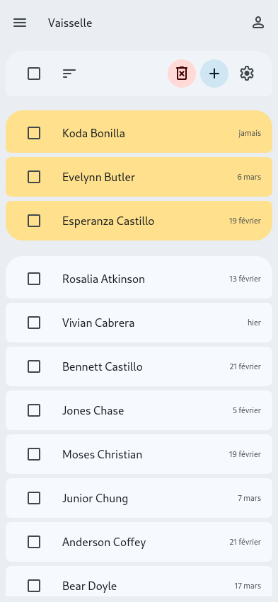
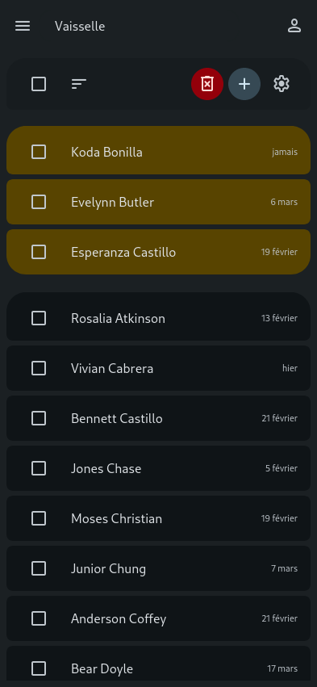

# Qu'est-ce que c'est que ce truc

Bonne question.

## Mais d'abord, pourquoi ?

J'avais envie de débloquer des nouvelles compétences et m'amuser un peu, et j'ai pensé à ce projet.

Les objectifs que je me fixe sont :

- une interface correcte en material 3 ;
- un backend en rust ;
- des données chiffrées de bout en bout directement par le navigateur.

Avec ces objectifs en main, j'ai commencé par la partie la plus évidente : l'interface.
C'est désormais chose faite : j'ai créé une page web dont le style correspond à ce que je recherche, globalement prête, et qui va me permettre de commencer à coder réellement la logique du site web.
Le projet atteint un stade allant plus loin que juste une idée, je créé donc un dépôt pour.
J'ai maintenant comme roadmap :

- nettoyer le projet (l'arborescence est un bazar) ;
- commencer à implémenter la logique navigateur (création des composants, format et stockage des données) ;
- commencer un rapide backend en rust pour stocker des données ;
- commencer à mettre en place le système de chiffrement ;
- implémenter le système de chiffrement dans l'application.

Maintenant que nous avons vu le pourquoi et le comment, regardons rapidement le quoi.

## On revient à la question de base ?

Chooser est une application web permettant de choisir aléatoirement et de manière intelligente des personnes dans une liste de personnes.
Les usages peuvent inclure :

- utilisation en collectivité pour décider des tâches ;
- utilisation par des professeur pour le ramassage aléatoire de devoirs ;
- récompenses dans le cadre d'un giveaway ;
- etc...

Je ne souhaite pas mettre en production l'application, ces usages sont donc uniquement spéculatifs et à titre indicatif.

Les fonctionnalités incluses seront :

- création de listes de personnes ou d'objets nommées ;
- tirage aléatoire intelligent (les personnes tirées dernièrement sont moins susceptibles d'être tirées à nouveau) d'entrées dans une liste ;
- paramétrage des caractéristiques du tirage aléatoire par liste (plusieurs algorithmes seront disponibles et auront différents paramètres) ;
- possibilité de synchroniser les données avec un serveur et d'y accéder depuis les principaux types d'appareils (ordinateur, téléphone et tablette).

Pour le moment, voilà à quoi ressemble l'interface :

J'héberge le site à [cette addresse](https://chooser.ascpial.fr/).

Les technologies utilisées pour l'interface sont les suivantes :

- [Material Web](https://material-web.dev/), les composants web de [Material Design](https://m3.material.io/) ;
- rollup, un outil pour compacter les dépendances en un seul fichier ;
- de l'HTML, du CSS et du JS basique ;
- [Google Fonts](https://fonts.google.com/) pour les icônes (l'appel aux services de Google ne sera présent que dans l'environnement de développement).
